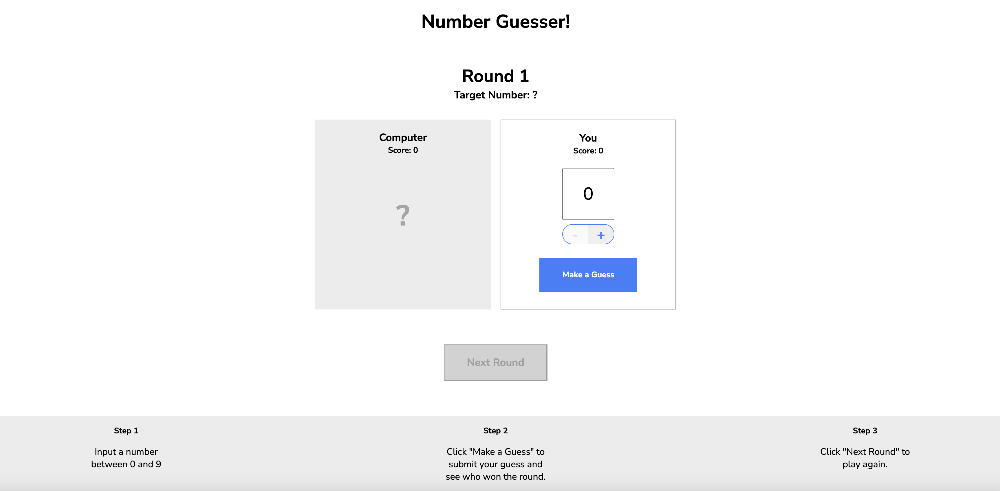

# Codecademy Company Javascript Number Guesser

## Table of contents
* [Project Goals](#project-goals)
* [Built with](#built-with)
* [How to use](#how-to-use)
* [Images](#images)

## Project Goals
In this project, you’ll write JavaScript functions to power a small guessing game. Your code will run in the browser instead of the terminal, and you can use your browser’s console to help you test your functions and view any syntax errors.

## Built with
* HTML
* CSS
* Javascript

## How to use
1. Clone the repository and change directory.

```bash
git clone https://github.com/trevoramaco/javascript.number-guesser.git
```

2. Open `javascript.number-guesser/index.html` file.

## Images


